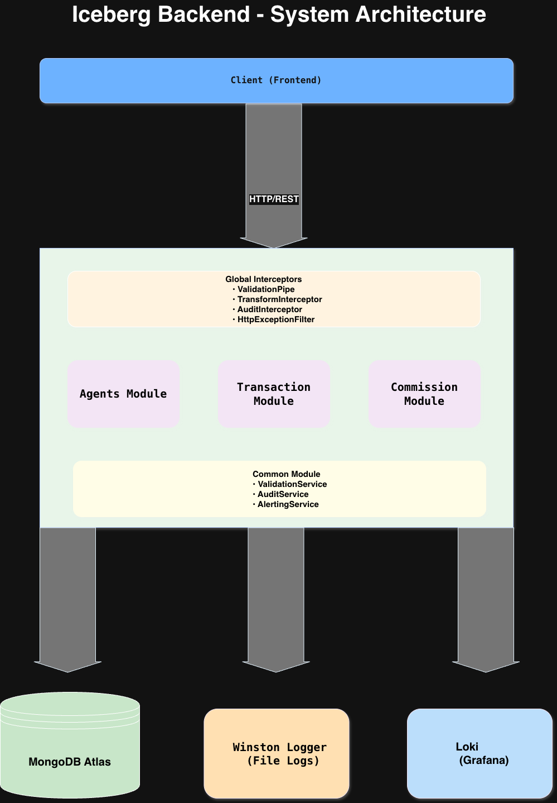

# Design Document

Bu doküman, Iceberg Backend projesinin mimari tasarımını, veri modelini, alınan tasarım kararlarını ve gelecek iyileştirmeleri açıklar.

## 1. Architecture & Data Model

### 1.1 NestJS Modül Yapısı

Proje, NestJS'in modüler mimarisini takip ederek domain-driven design prensiplerine uygun şekilde organize edilmiştir.

#### Modül Hiyerarşisi

```
AppModule (Root)
├── ConfigModule (Configuration)
├── MongooseModule (Database Connection)
├── WinstonModule (Logging)
├── CommonModule (Shared Services)
│   ├── ValidationService
│   ├── AuditService
│   └── AlertingService
├── AgentsModule (Agent Management)
├── TransactionsModule (Transaction Management)
│   └── StageValidationService
├── CommissionsModule (Commission Calculation)
└── SimulationModule (System Simulation)
```

#### Katman Mimarisi

Her modül standart NestJS katman yapısını takip eder:

1. **Controller Layer**: HTTP isteklerini karşılar, DTO validation yapar, response döner
2. **Service Layer**: Business logic'i içerir, veritabanı işlemlerini yönetir
3. **Entity Layer**: Mongoose schema tanımlamaları yapılır ve veri modelimizi temsil eder.
4. **DTO Layer**: Data Transfer Objects, validation kurallarını barındırır

#### Neden Bu Yapı?

- **Separation of Concerns**: Her modül kendi sorumluluğuna odaklanır
- **SOLID Principles**: Single Responsibility, Dependency Inversion prensipleri uygulanır
- **Testability**: Her katman bağımsız test edilebilir
- **Maintainability**: Yeni özellikler eklemek veya mevcut özellikleri değiştirmek kolay
- **Reusability**: CommonModule'deki servisler tüm modüller tarafından kullanılabilir

### 1.2 MongoDB Collections ve Document Tasarımı

#### Transaction Collection

Transaction collection, işlem yaşam döngüsünü ve finansal bilgileri tutar:

```typescript
{
  _id: ObjectId,
  propertyId: string,
  propertyType: 'sale' | 'rental',
  totalServiceFee: number,
  listingAgentId: ObjectId (ref: Agent),
  sellingAgentId: ObjectId (ref: Agent),
  currentStage: 'agreement' | 'earnest_money' | 'title_deed' | 'completed',
  stageHistory: [
    {
      stage: string,
      timestamp: Date,
      notes?: string
    }
  ],
  commissionBreakdown?: {
    agencyAmount: number,
    agents: [
      {
        agentId: ObjectId,
        amount: number,
        role: 'listing' | 'selling' | 'both',
        percentage: number
      }
    ],
    calculatedAt: Date
  },
  deletedAt?: Date,
  deleted?: boolean,
  createdAt: Date,
  updatedAt: Date
}
```

**Tasarım Kararları:**

1. **Embedded Commission Breakdown**: Commission breakdown'ı transaction document'ine gömülü olarak sakladık. Alternatif olarak ayrı bir collection kullanılabilirdi, ancak:
   - Commission breakdown transaction'a sıkı bağlı, ayrı collection gereksiz join'ler yaratır
   - Transaction ile birlikte okunur, ayrı query gerektirmez
   - Atomic update sağlar

2. **Stage History Array**: Stage geçişlerini array olarak sakladık:
   - Audit trail sağlar
   - Geçmiş aşamaları sorgulayabiliriz
   - Timeline görüntüleme kolaylaşır

3. **Soft Delete**: `deletedAt` ve `deleted` field'ları ile soft delete:
   - Veri kaybını önler
   - Geri alma imkanı sağlar
   - Audit için önemli

#### Agent Collection

```typescript
{
  _id: ObjectId,
  name: string,
  email: string (unique),
  phone: string,
  deletedAt?: Date,
  deleted?: boolean,
  createdAt: Date,
  updatedAt: Date
}
```

**Tasarım Kararları:**

1. **Email Unique Index**: Email field'ına unique index ekledik:
   - Duplicate agent'ları önler
   - MongoDB seviyesinde constraint sağlar

2. **Minimal Fields**: Şu an için sadece temel bilgiler:
   - Gelecekte genişletilebilir (address, commission rate, vb.)
   - YAGNI prensibi uygulandı (İhtiyacımız olmayan geliştirmeyi yapmıyoruz.Nedeni gereksiz kod yazmamış oluyoruz çünkü gelecek olan özellik gerçekten bir ihtiyaç mı bizim için bilmiyoruz.)

#### AuditLog Collection

```typescript
{
  _id: ObjectId,
  action: 'CREATE' | 'UPDATE' | 'DELETE' | 'SOFT_DELETE' | 'STAGE_UPDATE',
  entityType: 'Agent' | 'Transaction',
  entityId?: string,
  userId?: string,
  ipAddress?: string,
  userAgent?: string,
  httpMethod?: string,
  endpoint?: string,
  requestId: string,
  before?: Record<string, any>,
  after?: Record<string, any>,
  changes?: string[],
  statusCode?: number,
  error?: string,
  duration?: number,
  metadata?: Record<string, any>,
  timestamp: Date
}
```

**Tasarım Kararları:**

1. **Generic Audit Log**: Tüm entity'ler için tek bir collection:
   - Merkezi audit yönetimi
   - Tutarlı log formatı
   - Kolay sorgulama ve raporlama

2. **Before/After Data**: Değişiklikleri tam olarak kaydeder:
   - Rollback imkanı (gelecekte)
   - Detaylı audit trail
   - Debug kolaylığı

### 1.3 Reddedilen Alternatifler ve Nedenleri

#### Alternatif 1: Commission Breakdown Ayrı Collection

**Reddedildi çünkü:**
- Transaction ile commission breakdown sıkı bağlı
- Ayrı collection gereksiz join'ler yaratır
- Atomic update zorlaşır
- Query complexity artar

**Seçilen çözüm:** Embedded document - daha basit, daha hızlı, atomic

#### Alternatif 2: Hard Delete

**Reddedildi çünkü:**
- Veri kaybı riski
- Audit trail eksikliği
- Geri alma imkanı yok
- Compliance sorunları

**Seçilen çözüm:** Soft delete - güvenli, geri alınabilir, audit-friendly

#### Alternatif 3: Stage Validation Controller'da

**Reddedildi çünkü:**
- Business logic controller'da olmamalı
- Test edilebilirlik zor
- Reusability eksik
- Single Responsibility ihlali
- Modüler yapımıza uyumsuzluk
- DRY ihlali

**Seçilen çözüm:** StageValidationService - ayrı service, test edilebilir, reusable

#### Alternatif 4: Commission Calculation Transaction Service'de

**Reddedildi çünkü:**
- Transaction service zaten karmaşık
- Commission logic ayrı test edilmeli
- Farklı modüller commission hesaplayabilir (gelecekte)

**Seçilen çözüm:** CommissionsModule - ayrı modül, single responsibility, testable

#### Alternatif 5: Audit Logging Manuel (Her Endpoint'te)

**Reddedildi çünkü:**
- Code duplication
- Unutulma riski
- Tutarsız log formatı
- Maintenance zorluğu

**Seçilen çözüm:** AuditInterceptor - otomatik, merkezi, tutarlı

## 2. Most Challenging / Riskiest Part

### 2.1 En Zorlu Kısım: Dynamic Service Resolution in Audit Interceptor

**Sorun:**
AuditInterceptor, farklı entity'ler için (Agent, Transaction) audit log kaydetmek zorunda. Ancak interceptor, hangi service'in kullanılacağını bilmiyor. Örneğin, Transaction update edildiğinde `TransactionsService.findOne()` çağırmamız gerekiyor, Agent update edildiğinde `AgentsService.findOne()`.

**Çözüm:**
`ModuleRef` kullanarak runtime'da dinamik olarak service'leri resolve ettik:

```typescript
// AuditInterceptor içinde
const serviceName = `${entityType}Service`; // "TransactionService" veya "AgentService"
const service = this.moduleRef.get(serviceName, { strict: false });
const beforeData = await service.findOne(entityId);
```

**Riskler:**
1. Service isimlendirme tutarsızlığı
2. Service bulunamazsa hata
3. Circular dependency riski

**Risk Azaltma:**
1. Service isimlendirme convention'ı belirlendi
2. Try-catch ile graceful error handling
3. Optional dependency injection kullanıldı
4. Unit testlerle tüm senaryolar test edildi

### 2.2 İkinci Zorlu Kısım: Commission Calculation Edge Cases

**Sorun:**
Komisyon hesaplama kuralları basit görünse de edge case'ler var:
- Aynı agent hem listing hem selling: %50 mi yoksa %100 mü?
- Farklı agent'lar: Her biri %25 mi?
- Decimal precision: Yuvarlama hataları?
- Zero veya negative amount: Ne olacak?

**Çözüm:**
1. Detaylı validation: `validateTransaction()` method'u
2. Constants dosyası: Tüm oranlar merkezi yerde
3. Unit testler: Tüm edge case'ler test edildi
4. Type safety: TypeScript ile compile-time kontrol

**Risk Azaltma:**
1. Comprehensive unit tests
2. Integration tests ile gerçek senaryolar
3. Simulation module ile end-to-end test
4. Constants dosyası ile değişiklikler kolay

### 2.3 Üçüncü Zorlu Kısım: Stage Transition Validation

**Sorun:**
Stage geçişleri sıkı kurallara tabi:
- Agreement → Earnest Money (OK)
- Agreement → Completed (NOT OK)
- Completed → Title Deed (NOT OK - geriye dönüş yok)

**Çözüm:**
`StageValidationService` ile merkezi validation:
- Valid transitions map'i
- Aynı stage'e geçiş engelleme
- Completed'dan sonra geçiş engelleme

**Risk Azaltma:**
1. Unit tests: Tüm geçiş kombinasyonları
2. Integration tests: Gerçek API çağrıları
3. Clear error messages
4. Type-safe enums

## 3. If Implemented in Real Life — What Next?

### 3.1 Authentication & Authorization

**Neden gerekli:**
- Şu an herkes tüm endpoint'lere erişebilir
- Agent'lar sadece kendi transaction'larını görmeli
- Admin'ler tüm işlemlere erişebilmeli
- Audit log'larda user bilgisi eksik

**Nasıl implement edilir:**
- JWT-based authentication
- Role-based access control (RBAC)
- Agent, Manager, Admin rolleri
- Protected routes decorator'ları

**Öncelik:** Yüksek - Production için kritik

### 3.2 Reporting & Analytics

**Neden gerekli:**
- Agent performans raporları
- Aylık/yıllık komisyon özetleri
- Transaction trend analizi
- Revenue forecasting

**Nasıl implement edilir:**
- Reporting service
- Aggregation pipeline'ları
- PDF export
- Dashboard API'leri

**Öncelik:** Orta - Business intelligence için önemli

### 3.3 Rule Engine for Commission Calculation

**Neden gerekli:**
- Şu an komisyon kuralları hard-coded
- Farklı property type'lar için farklı kurallar olabilir
- Zamanla kurallar değişebilir
- A/B testing için esneklik gerekir

**Nasıl implement edilir:**
- Rule engine library (json-rules-engine)
- Rule configuration database
- Rule versioning
- Rule testing framework

**Öncelik:** Orta - Gelecekteki esneklik için

### 3.4 Notification System

**Neden gerekli:**
- Agent'lara transaction update bildirimleri
- Stage değişikliklerinde email/SMS
- Commission hesaplandığında bildirim
- Deadline yaklaşınca uyarı

**Nasıl implement edilir:**
- Event-driven architecture
- Email service (SendGrid, AWS SES)
- SMS service (Twilio)
- Push notifications (gelecekte)

**Öncelik:** Orta - User experience için önemli

### 3.5 Advanced Audit & Compliance

**Neden gerekli:**
- GDPR compliance
- Data retention policies
- Audit log encryption
- Compliance reporting

**Nasıl implement edilir:**
- Audit log encryption
- Data retention policies
- PII (Personally Identifiable Information) masking
- Compliance export

**Öncelik:** Düşük - Compliance gereksinimlerine bağlı

### 3.6 Performance Optimization

**Neden gerekli:**
- Büyük transaction listelerinde yavaşlık
- Commission calculation cache
- Database indexing optimization
- Query optimization

**Nasıl implement edilir:**
- Redis cache layer
- Database index optimization
- Pagination improvements
- Query result caching

**Öncelik:** Orta - Scale edildiğinde gerekli

### 3.7 Integration with External Systems

**Neden gerekli:**
- CRM sistemleri ile entegrasyon
- Accounting software (QuickBooks, Xero)
- Payment gateway'ler
- Document management systems

**Nasıl implement edilir:**
- REST API clients
- Webhook support
- Event streaming (Kafka, RabbitMQ)
- API gateway

**Öncelik:** Düşük - Business requirements'a bağlı

## 4. Diagram: System Architecture

Sistem mimarisi diyagramı aşağıda gösterilmiştir. Detaylı diyagram için [draw.io](./diagrams/architecture.drawio) dosyasına bakabilirsiniz.



**Not:** Diyagramı Draw.io'da oluşturduktan sonra:
1. `diagrams/architecture.png` olarak PNG formatında export edin
2. `diagrams/architecture.drawio` olarak Draw.io formatında kaydedin (düzenleme için)

## 5. Key Design Principles Applied

1. **SOLID Principles**: Her modül ve service tek bir sorumluluğa sahip
2. **DRY (Don't Repeat Yourself)**: CommonModule ile kod tekrarı önlendi
3. **Separation of Concerns**: Controller, Service, Entity katmanları ayrı
4. **Dependency Injection**: NestJS DI container kullanıldı
5. **Testability**: Her katman bağımsız test edilebilir
6. **Type Safety**: TypeScript ile compile-time hata kontrolü
7. **Error Handling**: Merkezi exception filter ile tutarlı hata yönetimi

## 6. Conclusion

Bu tasarım, ölçeklenebilir, test edilebilir ve maintainable bir sistem sağlar. Modüler yapı sayesinde yeni özellikler kolayca eklenebilir, mevcut özellikler güvenle değiştirilebilir. Soft delete, audit logging ve comprehensive testing ile production-ready bir sistem oluşturulmuştur.Her güncelleme sonrasında  devsecops yönetimi ile güvenli bir sistem oluşturmak amaçlanmıştır.

